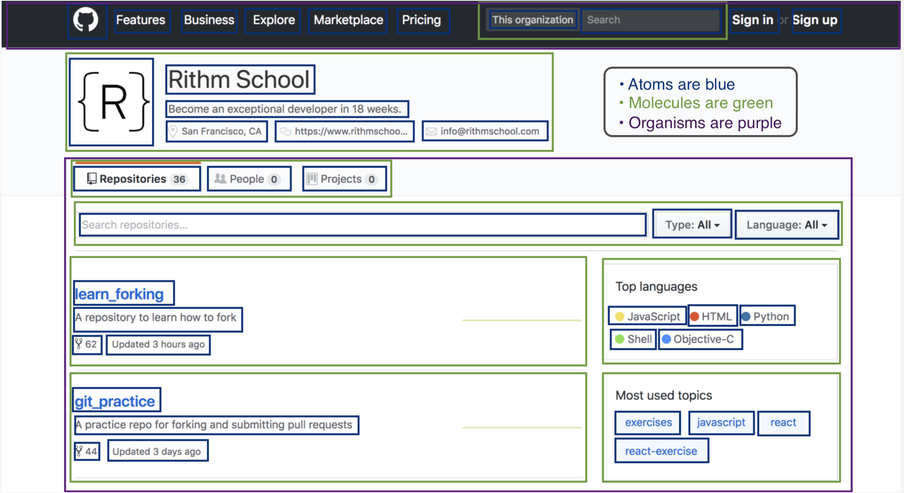

# MOCOMOCO-APP

모코모코 앱입니다. 🐳

## 📱 주요 기술스택

- ionic capacitor
- react
- typescript
- mobx

## 🛠 Set up

```
npm install -g ionic@latest
npm install -g yarn
npm install -g concurrently
npm install -g nodemon
yarn
yarn dev
```

## ⚙️ 프로젝트 구조

### 컴포넌트 컨벤션

1. 구조
   atmoic design pattern을 따른다.
   https://www.rithmschool.com/courses/intermediate-react/react-design-patterns



- atoms : Text와 같은 가장 작은 단위
- molecules : atom 컴포넌트가 모인 단위, http 통신 불가
- organisms : molecules가 모인 단위, http 통신 가능
- modals : 모달 컴포넌트

2. 네이밍

- 이름 끝에 접미사로 `Component`를 붙인다.
  `TextBaseComponent.tsx`
- export 시에는 접미사 `Component`를 제외하고 default export를 사용하지 않는다.

```typescript
export const Text = ({ children, className }: { children: React.ReactNode; className?: string }) => (
  <span className={`${className} text-base`}>{children}</span>
)
```

### CSS

### MOBX

- [MOBX 스터디 문서](docs/STUDY_MOBX.md)를 보고 MOBX의 주요 Decorator들을 학습하면 좋습니다.
- 추가 라이브러리 [mobx-task](https://github.com/jeffijoe/mobx-task)를 사용합니다. mobx-task는 api 호출시 사용하면 유용한 데코레이터 입니다. 자세한 설명 및 사용법은 `src/stores/news-store.ts` 를 참고하세요.
- store들은 `src/stores/index.ts` 에서 초기화하며, `src/hooks/store-provider.ts` 및 `src/hooks/use-store.ts`를 통해 hook로 만들어 아래와 같이 사용할 수 있게 하였습니다.

  ```typescript
  // src/components/example/NewsList.tsx
  import { useStore } from '../../hooks/use-store'

  const ExampleContainer: React.FC<INewsList> = () => {
    const { news } = useStore()

    useEffect(() => {
      news.getNews()
    }, [])
    ...
  }
  ```

## 🚀 빌드

[빌드 프로세스들을 이곳에서 관리합니다. ](docs/BUILD.md)

## ❗️ 이슈

[개발중 유의사항이나, 문제점들을 기록합니다. ](docs/ISSUE.md)

## 📚 스터디

개발에 필요한 지식들을 모아둡니다.

- [CAPACITOR](docs/STUDY_CAPACITOR.md)

- [MOBX](docs/STUDY_MOBX.md)

## 🕹 Capacitor 플러그인 목록

- 앱 내 저장 : https://capacitorjs.com/docs/apis/storage

## Reference

react-hooks-mobx : https://github.com/stolenng/react-hooks-mobx

ionic-react-conference-app : https://github.com/ionic-team/ionic-react-conference-app
