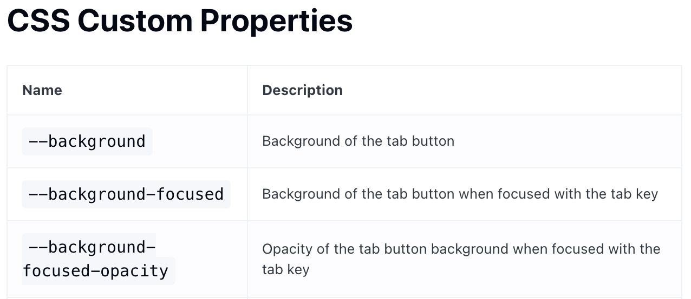

## IonSlides

```typescript
<IonSlides key={urls.join('_')} pager={true} options={slideOpts}>
```

key값이 변해야 slides가 정상적으로 destroyed 된다.
https://github.com/ionic-team/ionic-framework/issues/18782#issuecomment-558075082

## \_ionic.scss와 \_variable.scss의 역할 정리

`_ionic.scss`에는 dark테마나 ios, android 등 여러 selector를 구분하여 각각 변수값들을 다르게 설정해둘 수 있다. 이 때, 변수명은 `--`로 시작해야 하며, `var(변수)` 함수를 이용해서 scss 상에서 참조할 수 있다.

`_variable.scss`에는 `$`나 `%` 등 일반적인 sass변수들을 설정해뒀고, scss 파일에서 변수명만으로 편하게 가져다 쓸 수 있다. 단, 위에 언급한 것처럼, ionic 변수나 커스텀 프로퍼티를 정의할 때는 참조가 안된다.

서로 간의 참조순서를 정리해 보자면, `_ionic.scss`에는 테마별 기본값을 적어두고, `_variable.scss`에서는 그 값을 가져다 쓰면 되겠다. 즉, `_ionic.scss`에 테마별 selector별로 변수값들을 설정해두고, `_variable.scss`에서는 현재 선택된 selector의 값을 동적으로 참조하는 구조가 된다.

## Ionic Custom Property & Css Variables



Ionic 변수 또는 커스텀 프로퍼티를 정의할 때 `var(변수)` 함수로 다른 ionic 변수를 참조할 수 있다. 이 때 주의할 것은, `--`로 시작하는 변수명만 참조가능하다는 점이다. 그외에 `$`로 시작하는 등 다른 형식의 sass변수는 참조가 안된다. 그런 이유로, `var()`로는 `_variable.scss`의 변수들을 참조할 수 없다. 그리고 `var()` 없이 `$primary`처럼 변수명만 써도 참조할 수 없다.

Ionic의 CSS 변수명은 `--`로 시작하도록 제약되어 있고, `:root` 등 selector 내부에만 정의할 수 있다. `_variable.scss`의 변수명을 `--`로 시작하도록 변경하려면 selector를 적용해야 한다.

아이오닉 컴포넌트(ex IonInput)에서는 커스텀 프로퍼티를 사용해야만 CSS가 적용되는 경우가 있다. 이 때에도 마찬가지 룰이 적용된다.

https://ionicframework.com/docs/theming/css-variables

```
  ion-tab-buttons {
    --background: var(--ion-color-primary);
  }
```

## IonReactRouter 사용을 조심하자.

ionic에서 제공하는 IonReactRouter + IonRouterOutlet 조합으로 IonPage 컴포넌트들을 라우팅할 수 있고, page 전환을 맡아서 처리해준다.
하지만, 현재 ionic 버젼 5인데, 아직 버그성 동작들이 있어 보인다.

- ISSUE.md의 IonReactRouter 사용 시 라우팅이 중복 발생하는 이슈 참고하자

IonRouterOutlet을 사용하지 않으면 useIonViewWillEnter 등 ionic lifecycle hook들이 trigger되지 않는데,
이 부분들을 useEffect로 대체해보고 동작상 문제될 것이 없다면 react-router-dom.Router + Switch 조합으로 라우팅 구성하는게 나아보인다.

## 버튼 누른 후에도 키보드 계속 표시되게 하는 방법

- android : 버튼의 onMouseEvent 안에서 e.preventDefault() 를 호출해 줘야 함

```typescript
<div onMouseEvent={(e) => e.preventDefault()} onClick={() => somthing} />
```

- iOS : cordova config에 KeyboardDisplayRequiresUserAction=false 로 설정해 줘야 함

```typescript
  // capaciator.config.ts
  cordova: {
    preferences: {
      KeyboardDisplayRequiresUserAction: 'false',
    },
  },
```
